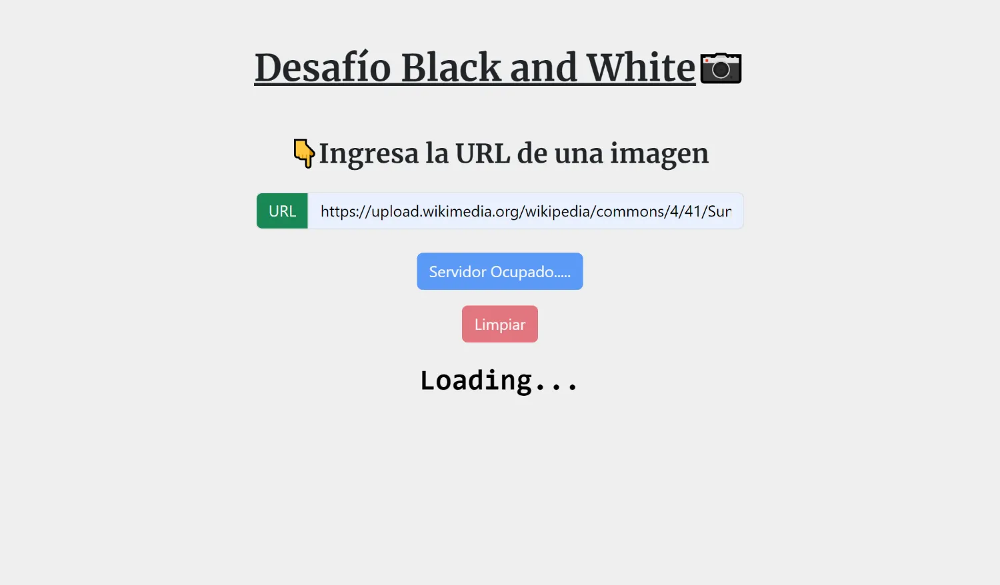

# Desafío 5 Black and White

Este repositorio contiene el código solución al desafío número 4 **Black and White** del módulo **Desarrollo de aplicaciones web con Node y Express** de la beca **Desarrollo de aplicaciones Full Stack Javascript Trainee** dictada por Desafío Latam.

## Requisitos

Los requisitos del proyecto son los siguientes:


## Proyecto Finalizado: Diagrama de Flujo

### 1. Vista Inicial


### 2. Servidor Procesando



### 3. Imagen Procesada


### 4. Error de procesamiento en el servidor


### 5. Error de URL inválida


## Librerias utilizadas

| Tecnologías Utilizadas |
| ---------------------- |
| Express                |
| Express-handlebars     |
| Bootstrap              |
| JQuery                 |
| Jimp                   |
| UUID                   |

## Soluciones

### 1.El servidor debe disponibilizar una ruta raíz que devuelva un HTML con el formulario para el ingreso de la URL de la imagen a tratar. (3 Puntos)

La ruta que disponibiliza la vista llamada **inicio** que contiene el formulario para ingresar la URL de una página la he creado usando el siguiente código:

```js
router.get("/", (req, res) => {
  res.render("inicio");
});
```

La vista **inicio** contiene el siguiente código handlebars:

```hbs
<header class="my-5">
  <h1>
    <span class="text-decoration-underline"> Desafío Black and White</span>📷
  </h1>
</header>

<section class="container my-5">
  <h3>👇Ingresa la URL de una imagen </h3>
  <form
    action="http://localhost:3000/procesa_imagen"
    id="formulario_ingresa_imagen"
  >
    <div class="input-group my-4">
      <label
        class="input-group-text bg-success text-light"
        id="url"
        for="input_url"
        title="Ingresa la url de una imagen en el input"
      >URL</label>
      <input
        name="imagen"
        type="text"
        class="form-control"
        placeholder="Ingresa la url de una imagen"
        aria-label="Ingresa la url de una imagen"
        aria-describedby="url"
        id="input_url"
      />
    </div>
    <button id="btn_enviar_url" type="submit" class="btn btn-primary">Subir
      Imagen al Servidor</button>
    <button
      type="button"
      id="btn_limpiar"
      class="btn btn-danger mt-3"
      title="Limpiar el campo de URL"
    >Limpiar</button>
  </form>
  <div class="loader" id="loader"></div>
</section>
```

### 2.Los estilos de este HTML deben ser definidos por un archivo CSS alojado en el servidor. (2 Puntos)

Estilizo la vista anterior usando bootstrap y un archivo css creado en la carpeta public las cuales disponibilizo del lado del cliente a partir del siguiente código:

```js
router.use("/public", express.static(path.join(__dirname, "..", "public")));

router.use(
  "/bootstrap_css",
  express.static(
    path.join(__dirname, "..", "node_modules", "bootstrap", "dist", "css"),
  ),
);
```

### 3.El formulario debe redirigir a otra ruta del servidor que deberá procesar la imagen tomada por la URL enviada del formulario con el paquete Jimp. La imagen debe ser procesada en escala de grises y redimensionada a unos 350px de ancho. (3 Puntos)

La otra ruta del servidor que maneja la data enviada del formulario es la siguiente:

```js
router.get("/procesa_imagen", procesaImagen);
```

Para lo cual utilizo la función **procesaImagen** siguiente:

```js
async function procesaImagen(req, res) {
  const { imagen: imagenURL } = req.query;

  if (validarURL(imagenURL)) {
    try {
      const imagenJimp = await Jimp.read(imagenURL);
      const nombreImagen = `img${generarID()}.jpg`;
      const rutaImagenServer = path.join(
        __dirname,
        "..",
        "images",
        nombreImagen,
      );
      const objeto = await imagenJimp
        .resize(350, Jimp.AUTO)
        .grayscale()
        .writeAsync(rutaImagenServer);

      res.status(200).render("imagen_formateada", {
        imagen: `./images/${nombreImagen}`,
      });
    } catch (err) {
      res.status(500).render("error_servidor", { error: err.message });
    }
  } else {
    res.status(400).render("url_invalida");
  }
}
```

### 4.La imagen alterada debe ser almacenada con un nombre incluya una porción de un UUID y con extensión “jpg”, por ejemplo: 3dcb6d.jpeg. (2 Puntos)

Para generar el ID único utilizo la siguiente función:

```js
function generarID() {
  return uuidv4().slice(0, 6);
}
```

Y creo la ruta de la imagen utilizando dicha función:

```js
const nombreImagen = `img${generarID()}.jpg`;
```

## Funcionalidad Extra

A los 5 minutos elimino todos los archivos creados en el servidor en la carpeta **images** la cual es la que almacena los archivos creados usando Jimp:

```js
function eliminarArchivosDeCarpeta() {
  const carpeta = path.join(__dirname, "..", "images");
  fs.readdir(carpeta, (err, archivos) => {
    if (err) {
      console.error("Error al leer el directorio:", err);
      return;
    }

    archivos.forEach((archivo) => {
      const rutaArchivo = path.join(carpeta, archivo);

      fs.unlink(rutaArchivo, (err) => {
        if (err) {
          console.error("Error al eliminar el archivo:", err);
        } else {
          console.log("Archivo eliminado:", rutaArchivo);
        }
      });
    });
  });
}

setInterval(eliminarArchivosDeCarpeta, 5 * 60 * 1000);
```
